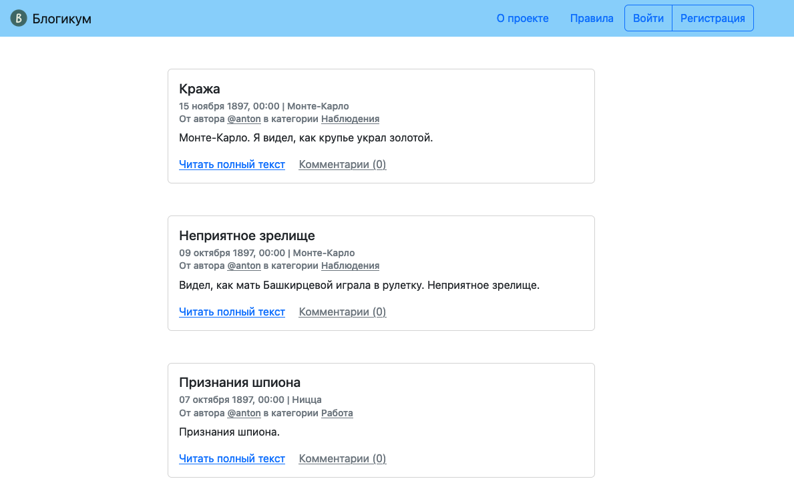
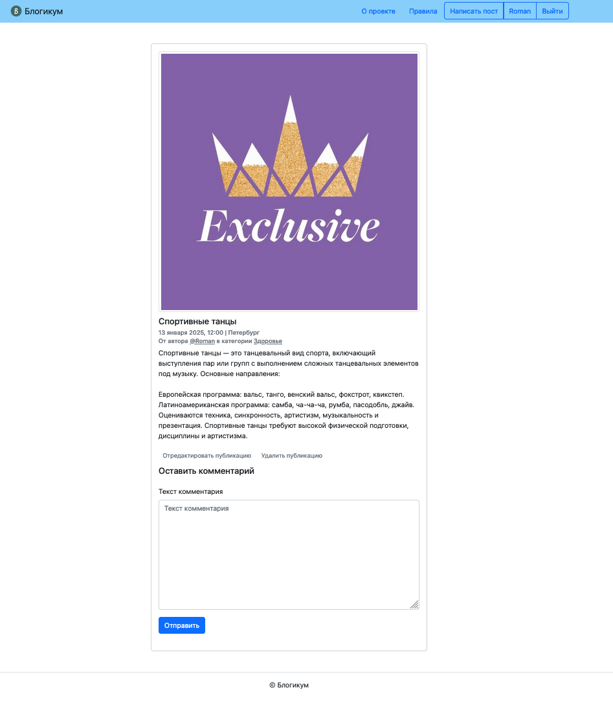

## Blogicum

### Описание проекта

**Blogicum** — это веб-приложение для публикации постов, просмотра категорий и управления комментариями. Проект реализован с использованием фреймворка **Django**.

---

### Основные функциональные возможности

- Создание, редактирование и удаление постов.
- Управление категориями и комментариями.
- Авторизация и регистрация пользователей.
- Адаптивный интерфейс.

---

### Структура проекта

```plaintext
blogicum/
├── blog/                        # Приложение "Блог"
│   ├── admin.py                 # Настройки административной панели
│   ├── apps.py                  # Конфигурация приложения
│   ├── forms.py                 # Формы для работы с данными
│   ├── models.py                # Модели данных
│   ├── urls.py                  # Маршруты приложения
│   └── views.py                 # Представления приложения
│   ├── migrations/              # Миграции базы данных
├── blogicum/                    # Основные настройки проекта
│   ├── asgi.py                  # Настройка ASGI
│   ├── settings.py              # Основные настройки проекта
│   ├── urls.py                  # Глобальные маршруты проекта
│   ├── wsgi.py                  # Настройка WSGI
├── db.json                      # Файл с исходными данными
├── db.sqlite3                   # База данных SQLite
├── manage.py                    # Управление проектом
├── media/                       # Медиафайлы
│   └── blogs_images/
├── pages/                       # Приложение "Страницы"
│   ├── urls.py                  # Маршруты приложения
│   ├── views.py                 # Представления приложения
│   ├── apps.py                  # Конфигурация приложения
├── static_dev/                  # Статические файлы
│   ├── css/                     # Стили CSS
│   │   └── bootstrap.min.css
│   └── img/                     # Изображения
│       ├── fav/                 # Значки фавиконов
│       └── logo.png
├── templates/                   # Шаблоны для рендеринга
│   ├── blog/                    # Шаблоны приложения "Блог"
│   ├── includes/                # Вспомогательные компоненты
│   ├── pages/                   # Шаблоны приложения "Страницы"
│   └── registration/            # Шаблоны для регистрации и авторизации
├── tests/                       # Тесты проекта
│   ├── adapters/                # Адаптеры для тестирования
│   ├── fixtures/                # Тестовые данные
│   └── form/                    # Тесты для форм
├── .gitignore                   # Исключенные файлы для Git
├── pytest.ini                   # Конфигурация Pytest
├── README.md                    # Документация проекта
├── requirements.txt             # Зависимости Python
└── setup.cfg                    # Конфигурация для Python
```

---

### Запуск проекта

1. Создайте виртуальное окружение (пример создания):

   ```bash
   python -m venv venv
   source venv/bin/activate  # Для macOS и Linux
   venv\Scripts\activate   # Для Windows
   ```

2. Установите зависимости:

   ```bash
   pip install -r requirements.txt
   ```

3. Примените миграции:

   ```bash
   python manage.py migrate
   ```

4. Загрузите данные в базу данных:

   ```bash
   python manage.py loaddata db.json
   ```

5. Запустите сервер разработки:

   ```bash
   python manage.py runserver
   ```

---

### Для запуска тестов используйте:

    ```bash
    pytest
    ```

### Системные требования

- Python 3.11
- Django 3.2+
- SQLite (или другая поддерживаемая база данных)



